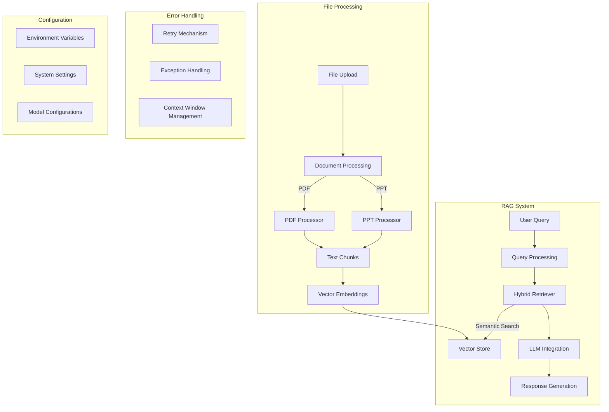

# RAG System Implementation Summary

## Table of Contents
1. [System Overview](#system-overview)
2. [File Processing System](#file-processing-system)
3. [RAG Implementation](#rag-implementation)
4. [Configuration and Setup](#configuration-and-setup)
5. [Error Handling](#error-handling)
6. [External Dependencies](#external-dependencies)

## System Overview

The system is a Retrieval-Augmented Generation (RAG) implementation that allows users to:
- Upload and process PDF and PowerPoint files
- Query the content of these documents
- Receive AI-generated responses based on the document content
- Export chat histories
- Manage conversation context

### Architecture Diagram



## File Processing System

### Document Upload
1. Files are uploaded through a Gradio interface
2. Supported formats: PDF (.pdf) and PowerPoint (.ppt, .pptx)
3. Files are temporarily stored and processed in batches

### Document Processing
1. **PDF Processing**
   - Text extraction with layout preservation
   - Table and image handling
   - Metadata extraction

2. **PowerPoint Processing**
   - Slide content extraction
   - Notes and speaker notes processing
   - Shape and text box handling

3. **Chunking Strategy**
   - Documents are split into manageable chunks
   - Chunk size is optimized for context windows
   - Overlap between chunks to maintain context
   - Chunks are tracked with source file information

## RAG Implementation

### Vector Store Integration
1. **Embedding Generation**
   - Uses Ollama embeddings for text vectorization
   - Optimized for semantic similarity search
   - Dimension reduction for efficiency

2. **Hybrid Retriever**
   - Combines dense and sparse retrieval methods
   - Dense: Vector similarity search
   - Sparse: Keyword-based search
   - Dynamic weighting based on query type

### Retrieval Methods

1. **BM25 (Sparse Retrieval)**
   - Implementation: Uses `BM25Okapi` from `rank_bm25` library
   - Process:
     - Documents are tokenized into words
     - Query is tokenized consistently
     - Scores documents based on term frequency and inverse document frequency
     - Handles rare and common terms differently
     - Returns top-k documents based on BM25 scores

2. **Dense Retrieval**
   - Implementation: Uses FAISS with L2 normalization
   - Process:
     - Documents and queries are converted to dense vectors
     - L2 normalization applied for better similarity matching
     - Fast nearest neighbor search using FAISS index
     - Returns top-k most similar documents

3. **Hybrid Search Process**
   ```mermaid
   graph TD
       A[Query] --> B[Dense Search]
       A --> C[Sparse Search/BM25]
       B --> D[Score Normalization]
       C --> D
       D --> E[Result Combination]
       E --> F[Cohere Reranking]
       F --> G[Final Results]
   ```

4. **Reranking System**
   - Implementation: Uses Cohere's reranking model
   - Features:
     - Model: 'rerank-english-v3.0'
     - Minimum relevance score threshold
     - Handles both new and legacy API formats
     - Fallback mechanisms for error cases
   - Process:
     - Takes combined results from dense and sparse search
     - Applies semantic reranking
     - Filters results based on relevance score
     - Returns reordered documents by relevance

5. **Score Normalization**
   - All scores normalized to [0, 1] range
   - Formula: `normalized_score = (score - min_score) / (max_score - min_score)`
   - Ensures fair comparison between different retrieval methods

6. **Error Handling**
   - Graceful degradation with fallbacks
   - Logging of reranking results and errors
   - Maintains system stability during failures

### Query Processing
1. **Query Analysis**
   - Query preprocessing and cleaning
   - Intent detection
   - Context window optimization

2. **Response Generation**
   - Context retrieval from vector store
   - LLM prompt construction with retrieved context
   - Stream-based response generation

## Configuration and Setup

### Environment Configuration
1. **Required Environment Variables**
   - LLM API configurations
   - Vector store settings
   - System parameters

2. **System Settings**
   - Chunk size configuration
   - Retry parameters
   - Context window limits
   - Memory management settings

### External Dependencies
```python
# Core Dependencies
gradio==4.x
langchain==0.x
pydantic==2.x
python-dotenv==1.x

# Document Processing
PyPDF2==3.x
python-pptx==0.x

# Vector Store
chromadb==0.x

# Utilities
tenacity==8.x
tiktoken==0.x
```

## Error Handling

### Retry Mechanism
1. **Automatic Retries**
   - Configurable retry attempts (default: 2)
   - Exponential backoff
   - Specific exception handling

2. **Context Window Management**
   - Dynamic context adjustment
   - History truncation when needed
   - Memory cleanup

### Exception Handling
1. **File Processing Errors**
   - File format validation
   - Corruption detection
   - Processing timeout handling

2. **RAG System Errors**
   - Query processing errors
   - Embedding generation failures
   - LLM response timeout

## User Interface

### Gradio Implementation
1. **Chat Interface**
   - Real-time response streaming
   - Message history management
   - File upload integration

2. **User Features**
   - Chat history export
   - Clear conversation
   - File processing status
   - Error feedback

## Performance Considerations

1. **Optimization Techniques**
   - Batch processing for multiple files
   - Caching of embeddings
   - Stream-based response generation
   - Efficient memory management

2. **Scalability Features**
   - Queue management
   - Concurrent processing limits
   - Resource optimization

## Security Measures

1. **Data Protection**
   - Temporary file handling
   - Secure file processing
   - API key protection

2. **Input Validation**
   - File type verification
   - Size limitations
   - Content validation

## Future Improvements

1. **Potential Enhancements**
   - Additional file format support
   - Advanced retrieval methods
   - UI/UX improvements
   - Performance optimizations

2. **Scalability Options**
   - Distributed processing
   - Cloud integration
   - Enhanced caching mechanisms 